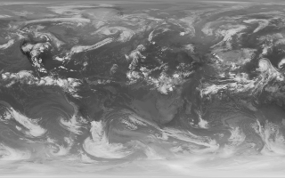

# scripts
misc scripts

removeduplicates.sh
-------------------
remove duplicate files in the current directory or the specified directory (if any)

wplatestgoes.sh
---------------
a script to fetch the two latest images from the noaa environmental visualization laboratory's daily repository (ftp://ftp.nnvl.noaa.gov/View/GOES/), create transition images between them, and set the wallpaper to one of the images every hour, progressing from the second latest image to the latest image.

