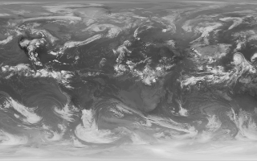

these scripts have not been tested with ash/dash. if something doesn't work, change the interpreter directive to use /usr/bin/bash.

directories
-----------
* standaloneshellscript/ - a little experiment with making shell scripts that have all of the resources they need embedded into the shell script itself. just a proof of concept for now

* scrapers/ - a collection of small website scrapers

scripts
-------
* anonmgur\_upload.sh - upload an image to [anonmgur](https://anonmgur.com)

* define.sh - define a word by parsing the gutenberg copy of webster's unabridged dictionary

* dumpinfo.sh - script that outputs lots of system information, mainly meant for checking on the status of remote servers

* email.sh - wrapper around the curl command for quickly sending emails from the command line. emails can either be pre-composed plaintext files or can be composed on the spot using your preferred text editor. there is also support for quickly encrypting the email body using gpg.

* html-font-demo.sh - generate a webpage that gives a demo of all currently installed fonts

* i3-locker.sh - a wrapper for i3lock that produces a somewhat fancier lock screen and changes the screen and dpms timeout. depends on [i3lock-color](https://github.com/eBrnd/i3lock-color), inspired by [i3lock-fancy](https://github.com/meskarune/i3lock-fancy).

* mpdalbumart.sh - automatically fetch and display album art of mpd's currently playing song with [meh](http://www.johnhawthorn.com/meh/). mpdalbumart.sh uses the following sources, in order of priority, and stops at the first source that returns valid art:
  * embedded art in the music files
  * art cached my mpdalbumart.sh
  * musicbrainz/archive.org cover art archive
  * slothradio/amazon

* posixman.sh - display man pages from the POSIX.1-2008 utilities manual by parsing data from the [online edition](http://pubs.opengroup.org/onlinepubs/9699919799/). posixman.sh will create a local repository of html pages in ~/Documents/posix_man_pages the first time it runs; subsequent runs will consult that repository. depends on w3m to convert the html to easy-to-read plaintext.

* qemuboot.sh - small script to manage qemu virtual machines

* remote-backup.py - a wrapper for rsync that generates rsync commands based on predefined targets. the first part of the script contains variables and dictionaries that must be configured for use. torsocks is automatically enabled for backup servers using onion services for nat punching.

* removeduplicates.sh - remove duplicate files in the current directory or the specified directory (if any)

* sortbylinelength.sh - sort the specified file so that the longest lines are first (or last, if -r is specified)

* sortimagesbyfx.sh - sort a directory of images according to a property of the images. for example: sort images according to increasing hue or increasing lightness

* trash.sh - wrapper for gvfs-trash that allows for quick trash operations like listing and restoring trashed items from the command line

* trim.c - an interactive "cut". not exactly a "script" but didn't warrant a new repository. precursor to trim.py; will probably be removed in the future.

* trim.py - an interactive "cut". reads text from stdin and allows the user select what will be copied or printed to stdout via an ncurses interface. you should probably use vipe from [moreutils](https://joeyh.name/code/moreutils/) instead.

* weather.sh - get the current weather from [openweathermap](http://openweathermap.org)

        $ ./weather.sh -m 2174003
        Weather for Brisbane: scattered clouds
        High:         14°C
        Current:      12.86°C
        Low:          11.8°C
        Humidity:     93%
        Wind:         2.6mph @ 200°
        Sunrise:      03:55:53 PM
        Sunset:       03:36:56 AM

* weather.py - alternative to weather.sh that gets data from [weather.gov](http://weather.gov) instead of openweathermap. the script may error if coordinates are not accurate enough; if this happens, try using the coordinates on wikipedia.

        $ ./weather.py 40.7127 -74.0059
        Current Weather for New York NY:
        Gradual Clearing

        Updated: 24 May 2016 @ 23:00 PM
        Temperature:       66°F
        Cloud Cover:       77%
        Sustained Wind:    5 mph @ 230°
        Humidity:          61%
        Precipitation:     8%

* workaholic.sh - keep your cpu busy when you're away by queueing cpu/io intensive tasks that would otherwise bottleneck resources and slow down your workflow. running tasks are paused when you return and resume when you leave again.

* wplatestgoes.sh - a script to fetch the two latest images from the noaa environmental visualization laboratory's daily repository (ftp://ftp.nnvl.noaa.gov/View/GOES/), create transition images between them, and set the wallpaper to one of the images every hour, progressing from the second latest image to the latest image.

